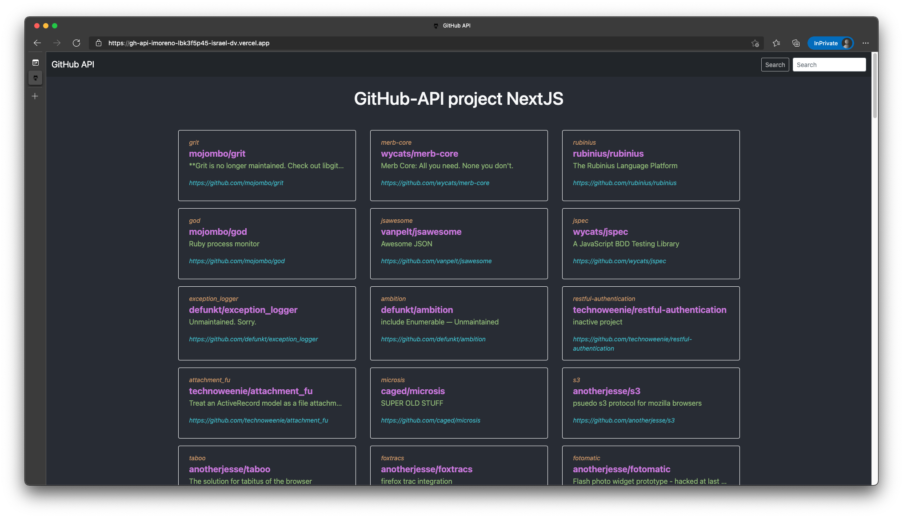

# GitHub API - NextJS

<hr>

GitHub API is a NextJS project. This project was created to improve, learn and practice the better soft skills.



## Tech/Framework used

- [Typescript](https://www.typescriptlang.org/)
- [NextJS](https://nextjs.org/)
- [Boostrap 5 9v.5.0.0-beta3](https://getbootstrap.com/)
- [GitHub API v.5](https://docs.github.com/en/rest)

⚠️ Bootsrap was installed/used via CDN to do the app more light

## Getting started

Write the following commands in the folder path in the terminal

```bash
# Install dependencies and libraries
1. yarn add
# Run project
2. yarn dev
```

Open [http://localhost:3000](http://localhost:3000) with your browser to see the result.

Or you can see the project [here](https://vercel.com/israel-dv/gh-api-imoreno/2hnCsYPLNAk4GURzfR2w84wi7CnW).

## In progress ♻️

- Pagination
- View to show specific information about users and repos

<hr/>
Feel free to download the code and use it in your own way and if you like you can review the code and make observations where you see errors or bad practices or simply contribute with something new.
